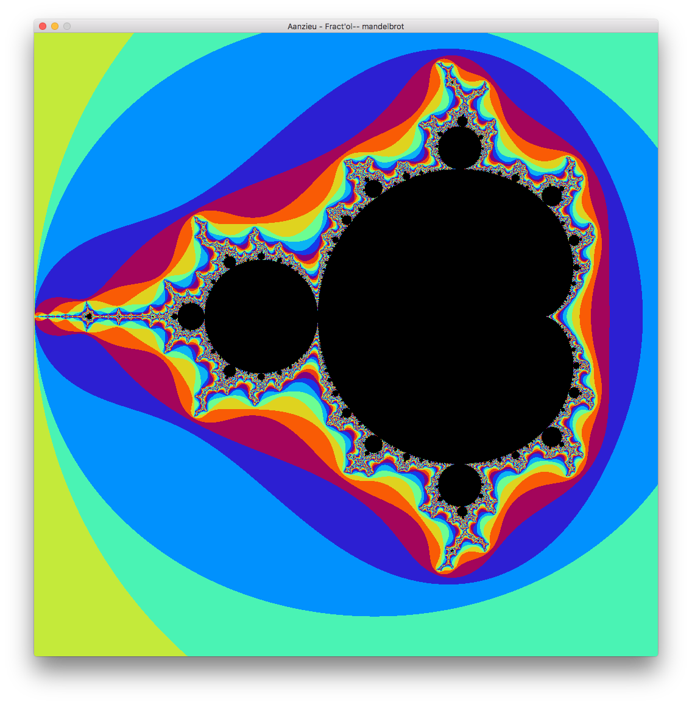
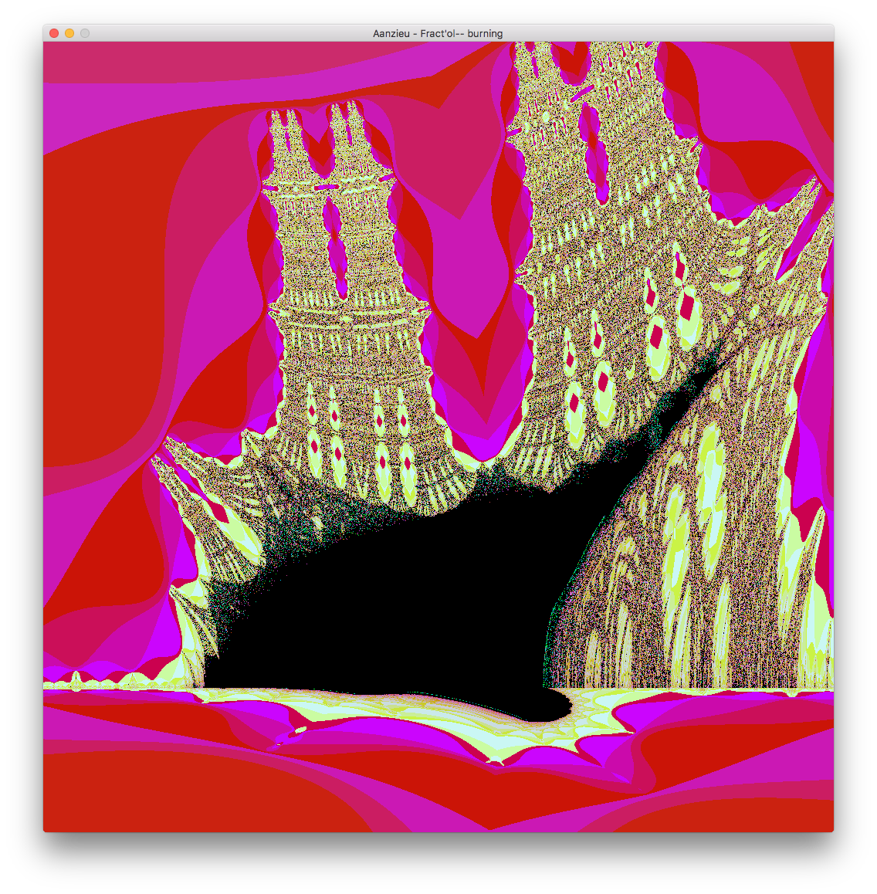
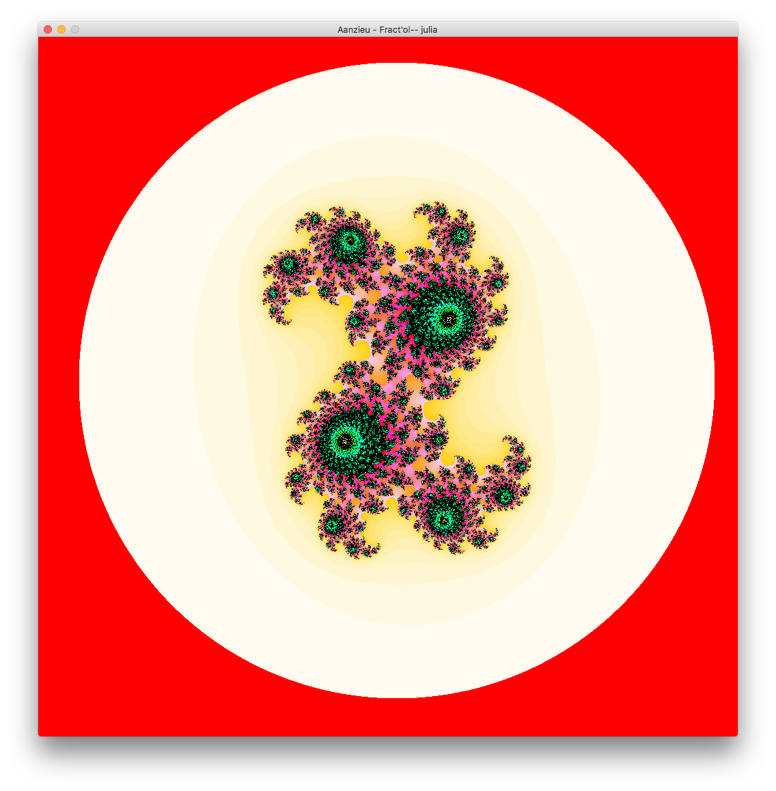

# Fractol

## Description

Fractol is a project aimed at exploring fractals, mathematical sets that exhibit a repeating pattern displayed at every scale.

### Features

- Render different fractals: mandelbrot, julia, burning ship
- Calculate values with Cuda
- Different color schemes (rotated and linear)
- Smooth HSL coloring
- Mouse move
- color gradients!

## Dependencies

Minilibx
Latest CUDA Toolkit

a Nvidia graphic card is required, to use GPU calculating.

## Installation

Clone the repository and run with:

``` bash
$> make
$> ./fractol [fractals]
```

- Possible fractals are: mandelbrot, julia, burning, sword, sponge, rabbit.
- Cycle color-schemes with 1-6 on the numpad.
- Increase/decrease maximum iterations with - and + on the numpad. 
- Zoom in and out with the mousewheel
- Press G to Calculate with GPU or C on the CPU
- Press F1 - F7 to change fractals inside program

## Media






## Authors

Antoine Anzieu
aanzieu@student.42.fr
